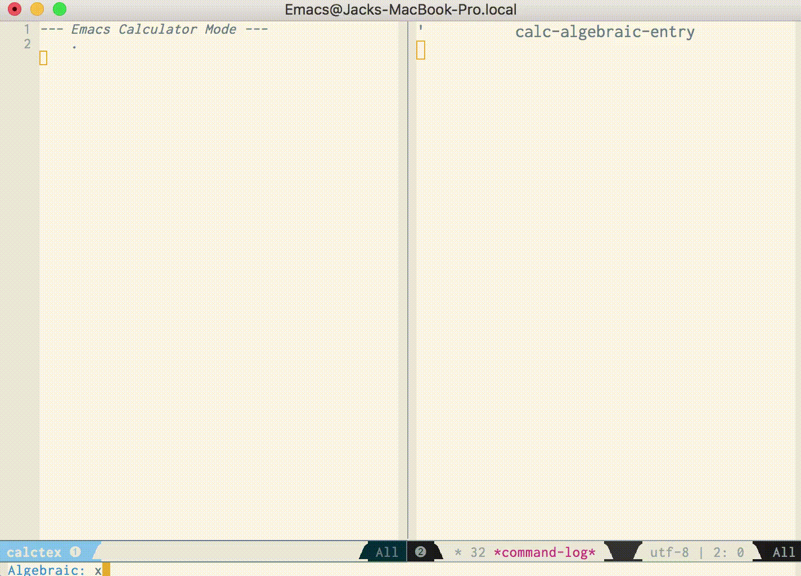
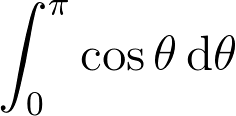

# Table of Contents

1.  [CalcTeX](#orgc67ad3b)
    1.  [Why a WYSIWYG equation editor?](#orgc1b4053)
        1.  [A Tool of Thought](#orge78610c)
        2.  [No clicking](#org2d0c7db)
2.  [Installation](#org03e079d)
    1.  [MacOS](#org2a81c17)
    2.  [LaTeX Packages](#org2f2223a)
3.  [Usage](#org6636708)
    1.  [Integrating with documents](#org6271775)
    2.  [Display options](#org92480f0)
        1.  [Scaling](#orga73e863)
        2.  [Other](#org0c04504)

# CalcTeX

CalcTeX is a GNU Emacs minor mode that turns the [Emacs Calculator](https://www.gnu.org/software/emacs/manual/html_mono/calc.html) into a WYSIWYG
editor for LaTeX formulas.

## Why a WYSIWYG equation editor?

Much [has](https://www.latex-project.org/about/) [been](https://www.quora.com/What-are-the-benefits-of-using-LaTeX-over-a-traditional-WYSIWYG-editor) [written](https://www.latex-project.org/about/) about the virtues of LaTeX *not* being a
What-You-See-Is-What-You-Get markup system. These arguments, however convincing
you find them, deal with LaTeX as a language for writing *text* in. I have never
seen any kind of argument that the LaTeX development cycle is beneficial for
writing mathematics.

On the contrary, editing mathematics in LaTeX is, frankly, horrible. The
experience bears zero resemblance to writing on the page. Whereas editing text
on the computer is faster than handwriting, editing mathematics lags far behind
in terms of user experience. Consider the difference between writing out an
integral by hand,

and typing the LaTeX source for that same formula:

The handwritten formula flows out of one's pen, and is a pleasure to write. On
the other hand, nothing about the LaTeX source code is ergonomic. The backslash
key is hard to reach, and long macro names and curly braces obscure the form of
the equation. When typing the formula, there is no visual feedback to remind you
where you are in the formula, alert you to any mistakes, or provide opportunity
for reflecting on the content of what you're typing.

### A Tool of Thought

A good editor should be a [tool of thought](http://www.eecg.toronto.edu/~jzhu/csc326/readings/iverson.pdf). Mathematical notation is the most
refined and sophisticated tool of thought in human history. When writing math on
the computer, we deserve an editor that **augments** the tool of mathematical
notation, not one that suffocates it.

### No clicking

WYSIWYG equation editors typically provide large menus of clickable buttons.
A more powerful, Emacs-y alternative is key commands. CalcTeX is a display mode
for Emacs Calc, which provides a huge number of key commands for manipulating
equations.

# Installation

## MacOS

Ensure that you have the `latex` and `tlmgr` binaries installed and on
your `$PATH`. The easiest way to install them is via the BasicTeX version of the
TeXLive distribution, which installs all the binaries but omits 2.5GB of CTAN
packages:

    brew cask install basictex

You'll need to reload your shell to get the TeXLive binaries on your `PATH`.
Check that you have them installed:

    latex -version
    tlmgr -version

## LaTeX Packages

CalcTeX makes use of a few LaTeX packages. To run CalcTeX with the default
settings, make sure that you have the following LaTeX packages installed:

-   `dvipng`
-   `xparse`
-   `xcolor`
-   `soul`
-   `adjustbox`
-   `collectbox`
-   `amsmath`
-   `amssymb`
-   `siunitx`

If you are using TeXLive, you can install these with `tlmgr`:

    sudo tlmgr update --self
    sudo tlmgr install dvipng l3packages xcolor soul adjustbox collectbox amsmath amssymb siunitx

You should now be able to run

    dvipng -version

Alternatively, you can modify the value of the `calctex-format-latex-header` 
variable:

    (setq calctex-format-latex-header "...")

However, be aware that doing so may compromise some facilities of CalcTeX,
particularly its selection handling.

# Usage

To fire up calc, invoke `M-x calc`, or `C-x * c`. `calctex-mode` will toggle the
minor mode in the calc buffer. You can type `'` for Algebraic entry mode, or
type a numeral to begin a numeric entry. Refer to the [Calc manual](https://www.gnu.org/software/emacs/manual/html_mono/calc.html) for the many
mathematical commands that are available.

## Integrating with documents

CalcTeX is designed to be used in conjunction with calc's [Embedded Mode](https://www.gnu.org/software/emacs/manual//html_node/calc/Embedded-Mode.html#Embedded-Mode). In a
LaTeX or Org buffer, move point to a LaTeX formula environment, and type 
`C-x * e` to invoke embedded mode. This will couple the top of the calc stack to the
contents of the equation in the buffer you are editing.

## Display options

### Scaling

CalcTeX currently offers two image format options: `png` and `imagemagick`. The
default is `imagemagick`, unless your Emacs is compiled without support. To
disable `imagemagick` even if it is supported:

    (setq calctex-iamgemagick-enabledp nil)

Note that disabling `imagemagick` may have negative effects on the image quality
on some displays: it disables downscaling the rendered image, which is sometimes
necessary for a sharp image.

The scaling factor applied by `imagemagick` is controlled by the variables
`calctex-base-imagemagick-png-scaling` and `calctex-imagemagick-png-scaling`.
The first controls the amount by which the "base" dots-per-inch value of
`calctex-base-dpi` is increased, to improve resolution of the rendered image.
This will have an immediate effect on the size of the overlay that appears in
the buffer, which can be corrected by adjusting `calctex-imagemagick-png-scaling`.

### Other

The variable `calctex-foreground-darken-percent` adjusts the foreground color of
the rendered images. The default color is the same as the foreground color of
the default face. This may appear too light for the font used by LaTeX, so it
may be darkened or lightened to improve the match with the rest of the buffer.

